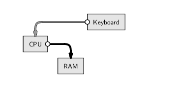

```{r setup, include=FALSE}
source("setup_knitr.R")
```

# Interagindo com o computador

O que significa este ícone?


<br>

- É um documento do Microsoft Excel?
- É um arquivo de **texto pleno**, separado por vírgulas (CSV *comma
  separated values*)
- De fato, o nome do arquivo é `final.csv` e não `final`
- O Excel pode sim abrir este arquivo... assim como milhares de outros
  programas!

O que está acontecendo?

- O computador (leia-se, nesse caso, o sistema operacional Windows)
  "proteje" o usuário dos detalhes sujos
- Isso é ruim? **Sim!**
- O usuário se acostuma com o computador ditando as regras
- É importante lembrar que é você quem deve dizer o que o computador
  deve fazer (nesse caso, com qual programa abrir certo arquivo)

O que deve acontecer?

- Para a maioria dos usuários, a interação com o computador se limita a
  clicar em links, selecionar menus e caixas de diálogo
- O problema com essa abordagem é que parece que o usuário é controlado
  pelo computador
- A verdade deve ser o oposto!
- É o usuário que possui o controle e deve dizer para o computador
  exatamente o que fazer
- Escrever código ainda tem a vantagem de deixar registrado tudo o que
  foi feito

Uma linguagem de programação nos permite interagir não só com outros
*softwares*, mas também com o nosso *hardware*


# Boas práticas para a computação científica

Cientistas passam cada vez mais tempo construindo e utilizando
*software*. No entanto, a maioria nunca foi ensinada como fazer isso de
maneira eficiente. Como resultado, muitos desconhecem as ferramentas e
práticas que os fariam escrever códigos mais consistentes e fáceis de
manter, com menor esforço.

Estudos recentes tem mostrado que cientistas passam cerca de 30% de seu
tempo escrevendo códigos. No entanto, mais de 90% deles são
primariamente auto-didatas, e portanto carecem de exposição à boas
práticas de desenvolvimento de *software* como: escrever códigos de
fácil manutenção, usar um *sistema de controle de versões*, rastreadores
de *bugs*, testes unitários, e automação de tarefas.

Para promover, encorajar, e padronizar a reproducibilidade de
investigações científicas, algumas práticas podem ser adotadas. De
maneira específica, podemos listar oito práticas consideradas essenciais
para que a reproducibilidade seja eficiente:

1. Escreva programas para humanos, não para computadores
    a. Crie nomes consistentes, distintos e que possuam significado
    b. A formatação e estilo de código deve ser consistente
2. Deixe o computador fazer o trabalho
    a. Crie funções para fazer tarefas repetitivas
    b. Use uma ferramenta de "construção" (`make` ou
    `rmarkdown::render()`) para automatizar *workflows*
3. Faça alterações incrementais
    a. Trabalhe em pequenos passos e frequentemente revise o que foi
    feito
    b, Use um sistema controlador de versões
4. Não repita você mesmo (ou outros)
    a. Faça o código modulável ao invés de copiar e colar
    b. Re-utilize código ao invés de reescrevê-lo
5. Prepare-se para erros
    a. Use uma plataforma de testes independente
    b. Transforme *bugs* (ou **resultados negativos**) em estudos de
    caso
6. Otimize código apenas depois que ele funcionar
    a. Primeiro a ideia, depois a otimização
    b. Escreva de maneira mais simples possível desde que não perca a
    eficiência
7. Documente a ideia e o propósito, não a mecânica
    a. Descreva motivos e razões, não implementações
    b. De preferência, documente o processo com códigos *embutidos* em
    texto
8. Colabore
    a. Use "programação em pares"
    b. Use um sistema de rastreamento de *bugs* e *issues*

(*Baseada em Wilson et al, 2014*).

## Editores de texto

Uma característica importante de códigos de programação é que eles são
em **texto puro**, por isso precisamos de um bom **editor de textos**

Características de um bom editor:

- **Identação automática**
- **Complementação de parênteses**
- **Destaque de sintaxe** (*syntax highlighting*)
- **Numeração de linhas**
- **Auto completar comandos**

### Editores para o R

- Interface padrão
- Rstudio
- Emacs + ESS
- Tinn-R
- Vim-R-plugin
- Gedit-R-plugin

## Estilo de código

O estilo de código é importante pois é uma forma de padronizar a forma
com que escrevemos o código. Essa padronização visa facilitar e otimizar
a leitura do código por você no futuro ou por outras pessoas.

Existem vários estilos de código (*coding standards*) propostos para o
R, no entanto, nenhum deles é "oficial". Você pode se adequar a um
estilo que achar mais apropriado, ou até mesmo criar o seu próprio
estilo. O importante é que isso fique claro para quem for ler seu código
posteriormente.

Alguns *coding standards* para o R são:

- [The tidyverse style guide](https://style.tidyverse.org) é um
  documento compreensivo sobre formatação de códigos no R. Desenvolvido
  por Hadley Wickham, é um dos guias mais utilizados atualmente.
- [Google’s R Style
  Guide](https://google.github.io/styleguide/Rguide.html) é o guia de
  estilo do R desenvolvido pelo Google. Atualmente é apenas uma
  modificação do *The tidyverse style guide*.
- [R Style Guide](https://jef.works/R-style-guide/) da JEFworks, com
  vaŕios exemplos de código.
- [R coding
  standards](https://cran.r-project.org/doc/manuals/r-release/R-ints.html#R-coding-standards)
  do manual oficial do R [R
  Internals](https://cran.r-project.org/doc/manuals/r-release/R-ints.html).
  Não é compreensivo, mas estabelece uma padronização de código para o
  editor Emacs.

Alguns mais expositivos são:

- [Writing Good R Code and Writing
  Well](https://rviews.rstudio.com/2016/12/02/writing-good-r-code-and-writing-well/),
  com várias dicas de Joseph Rickert.
- [Writing better R
  Code](https://www.bioconductor.org/help/course-materials/2013/CSAMA2013/friday/afternoon/R-programming.pdf)
  de Laurent Gatto, explica através de exemplos a utilidade dos padrões
  de código.
- [R Style. An Rchaeological
  Commentary](https://cran.r-project.org/web/packages/rockchalk/vignettes/Rstyle.pdf)
  é um artigo de Paul E. Johnson sobre o uso histórico de diferentes
  estilos de códigos no R e suas implicações.
- [R Coding Style
  Guide](https://irudnyts.github.io//r-coding-style-guide/) de Iegor
  Rudnytskiy, com vários exemplos e dicas para o RStudio.
- [Coding
  style](https://csgillespie.github.io/efficientR/coding-style.html),
  capítulo do livro [Efficient R
  programming](https://csgillespie.github.io/efficientR/) de Colin
  Gillespie e Robin Lovelace.
- [Guia de Contribuição e
  Estilo](http://leg.ufpr.br/~walmes/pacotes/labestData-vignettes/guia-contrib.html)
  desenvolvido pelo PET Estatística, com várias indicações visuais de
  formatação de código.


# Uma primeira sessão

### Configurando o diretório de trabalho

- O diretório de trabalho é uma pasta onde o R será
  direcionado. Todos os arquivos que serão importados (base de dados,
  ...) ou exportados (base de dados, gráficos, ...) por ele
  ficarão nesta pasta.
- Existem duas maneiras de configurar o
  diretório de trabalho (suponha que vamos usar a pasta
  `~/estatcomp1`):

- `1)` Utilizando a função `setwd()` dentro do R:
```{r, eval=FALSE}
setwd("~/estatcomp1")
```

- `2)` Pelo menu do RStudio em `Session > Set Working Directory > Choose Directory...`
Confira o diretório que está trabalhando com a função
```{r, eval=FALSE}
getwd()
```

### O R como uma calculadora

O símbolo `>` indica que o R está pronto para receber um comando:
```{r, prompt=TRUE}
2 + 2
```
O símbolo `>` muda para `+` se o comando estiver incompleto:
```{r, prompt=TRUE, tidy=FALSE}
2 *
2
```
Espaços entre os números não fazem diferença:
```{r, prompt=TRUE}
2+         2
```

### Para onde vão os resultados?

```{r, prompt=TRUE}
1 + 3 + 5 + 7
```


- Note que o resultado é apenas mostrado na tela, nada é salvo na
  memória (por enquanto)

### O editor de scripts

- Para criar rotinas computacionais é necessário utilizar um editor
    de scripts.
- Clique em `File > New file > R script`. Salve com a extensão
    `.R`.
- Para enviar comandos diretamente para o console, selecione-os e
    aperte `Ctrl + <Enter>`.
- Para adicionar comentários ao script, utiliza-se o símbolo
    `#` antes do texto e/ou comandos. O que estiver depois do
    símbolo não será interpretado pelo R. Portanto:
```{r, eval=FALSE}
2 + 2     # esta linha será executada
# 2 + 2     esta linha não será executada
```

### Ordens de execução

As operações são realizadas sempre seguindo as prioridades:

1. De dentro para fora de parênteses `()`
2. Multiplicação e divisão
3. Adição e subtração

```{r}
5 * 2 - 10 + 7
5 * 2 - (10 + 7)
5 * (2 - 10 + 7)
5 * (2 - (10 + 7))
```

### "Salvando" resultados

1. Calcule a seguinte equação: $32 + 16^2 - 25^3$
2. Divida o resultado por $345$
3. Qual o resultado da expressão $\frac{e^{-2}  2^{4} - 1}{4!}$?
4. E do logaritmo desta expressão?

```{r}
x <- 32 + 16^2 - 25^3
x
x/345
(y <- (exp(-2) * 2^4 - 1)/factorial(4))
log(y)
```

Quando criamos uma variável (`x`, `y`), ela fica armazenada
**temporariamente** na memória RAM.



**O R é uma linguagem de memória RAM**

Para saber quais objetos estão criados, usamos a **função** `ls()`

```{r}
ls()
```

Estas variáveis ficam armazenadas no chamado *workspace* do R

- O *workspace* consiste de tudo que or criado durante uma sessão do R,
  **armazenado na memória RAM**

Para efetivamente salvar esas variáveis, podemos armazenar esse *workspace*
do R em disco, em um arquivo chamdo `.Rdata`


- Quando o R é iniciado em um diretório com um arquivo `.Rdata`, as
  variáveis salvas são automaticamente carregadas
- No entanto, é sempre melhor salvar os dados e o **script**, assim é
  possível gerar os resultados novamente, sem salvar nada sem
  necessidade
- Veremos mais pra frente como salvar variáveis específicas, por
  exemplo, resultados de uma análise que leva muito tempo para ser
  executada
- O mais importante é salvar o **código**, assim sabemos **como**
  chegamos a determinado resultado, e podemos recriá-lo depois

### Finalizando o programa

A qualquer momento durante uma sessão você pode usar o comando
```{r, eval=FALSE}
save.image()
```

No RStudio:

- `File > Save As...`
- Na janela que abrir, digite o nome do arquivo (por exemplo
  `script_aula1`) e salve
- Automaticamente o script será salvo com a extensão `.R`
  (nesse caso `script_aula1.R`) no diretório de trabalho que você
  configurou no início

Alternativamente, você pode também salvar toda sua área de trabalho,
clicando em `Workspace > Save As Default Workspace`. Este
processo irá gerar dois arquivos:

- `.Rdata`: contém todos os objetos criados durante uma
  sessão. Não é necessário (e nem recomendado) dar um nome antes do
  ponto. Dessa forma, a próxima vez que o programa for iniciado neste
  diretório, a área de trabalho será carregada automaticamente.
- `.Rhistory`: um arquivo texto que contém todos os comandos
  que foram digitados no console.


<!-- ## Formatos de arquivos -->

<!-- ### Texto pleno -->

<!-- ### CSV -->

<!-- ### Encoding -->

# Referências

* Leek, J. [The Elements of Data Analytic Style][datastyle]. Leanpub, 2015.
* Murrell,
  P. [Introduction to data technologies](https://www.stat.auckland.ac.nz/~paul/ItDT/HTML). Boca
  Raton: Chapman & Hall/CRC, 2009.
* Peng,
  RD. [R programming for data science](https://leanpub.com/rprogramming). Leanpub, 2015.


[dados]: http://simplystatistics.org/2013/12/12/the-key-word-in-data-science-is-not-data-it-is-science/
[RNYT]: http://www.nytimes.com/2009/01/07/technology/business-computing/07program.html?pagewanted=all&_r=0
[DSVD]: http://drewconway.com/zia/2013/3/26/the-data-science-venn-diagram
[datastyle]: https://leanpub.com/datastyle
